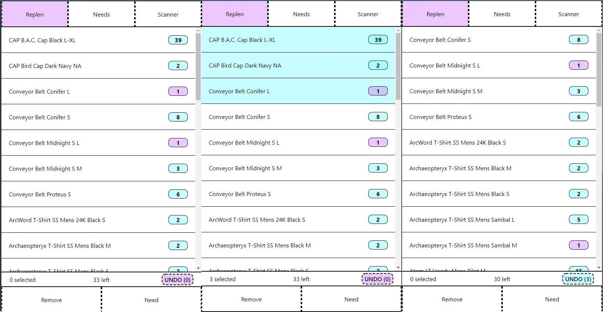

# csv-replenishment-server

A mobile first react application making it easier to replensish the floor in a retail store.

### Problem

While working at a retail store, we would manually print a CSV of things sold, and then check to see if they were on the floor. This was bad for serveral reasons, such as the massive waste of paper and the list was unorganized. If you lost the list overnight, then, someone would have to re-do the work, or it wouldn't be replened until the whole store was "manually replened".
Manual replen entailed two people working together, one person checking the back stock, and one person checking the floor to verify all of the sizes were on the floor. A time consuming proccess that took half a day.

### Solution

This application aims to solve above problem and as such it has the following features.

Front End:

* Two list types, "Replen" and "Needs"

  * Replen was the items sold for the day that needed checking (still had >1 in stock)
  * Needs were the items from replen that were not on the floor.
    * This list is what you would grab from the back of the store
  * These lists have basic convience features such as
    * Select and commit an action on mutliple items at once
    * Undo last operation
    * How many items left, how many selected
    * Sorting based on Unisex, Male, Female (How the store was divided)
       * Additiona sorting on "item classifications", such as size and area of item
    * Displays of how many are left, whith a highlight when there's only 1 left (to prevenet mindless searching if there's an inventory issue)
  * They are also "Server Owned", i6f a change you request to the list fails, the front end will not update.
    * This allows multiple people to safely work on the list, if something isn't working, a refresh should update the users list, which will sync with the latest server
* A Scanner

  * Scanning a garments tag would show all of the sizes in stock, and allow you to add the items not on the floor to the "Needs" list
  * This works by importing the entire inventory into the master list folder, which allows clients to use the backend route to search the inventory for sizes and quanitity through the barcode scanner

Backend:

* Multiple folders for the above lists, with file watching (instantly ingest and delete list)
  * CSV configuration for the above lists, telling what column to look at.
* Keep historics over lists
  * Allows adding replenishment lists "throughout the day", only adding new items sold, and ignoring items that were already added to the replen list
* Searching based on item code, and then returning a list of all sizes for a garment based on garment name
* A QR code is dropped for easy access on mobile device, eithier as an image file or a ASCII console art.
* Logging for actions done inside the server

All of the above gets then compiled into a EXE that when ran, sets up a folders for the list generation, shows a command prompt, generates the default config, and hosts the frontend.

## Showcase

Removing items:
  

Adding Items to Needs:
  

Scanning a barcode:
    > currently unable to show as I do not have a barcode, nor the data required to showcase searching. It also seems the barcode scanner plugin was also deprectated, and no longer works in a modern mobile browser, so a replacement needs to be found

## Building

Make sure you NPM install for the backend and the frontend folders.
Running the quickbuild.sh will compile the frontend, move it into the static folder for the backedn, and then setup some test data. Then to compile the exe, build inside ./backend will compile everything together and drop one exe with no dependeincies. The first run will drop the config and folder structure.

### Config:

the config should look like:

```ini
#hey you!
#ya you!
#don't touch this file.
#i mean it.
#really.

[general]
filereadtimer = 1200

[qr]
file = 1
console = 0

[lists]
basepath = './lists/'
list[] = 'replen'
list[] = 'needs'
list[] = 'master'
#psst! In general:
#inventory: the amount left / on hand
#code: the upc / item code

#this applies special filtering.
#allowing multiple replen lists
#to take out the differences
#along with removing duplicates and zeros.
#other lists don't need that soooo, set to 0
#types: 0 nothing, 1 replen, 
[replen]
type = 1
name = 'Description'
code = 'Item code'
inventory = 'Left'

[needs]
type = 0
name = 'Description'
code = 'Item code'
inventory = 'Left'

[master]
type = 0
name = 'Description'
code = 'Item code' #UPC HERE PLEASE
inventory = 'Left'
```

It's fairly straightforward and the user modifiable parts are really the [**] lists, as they control the columns from the CSV
